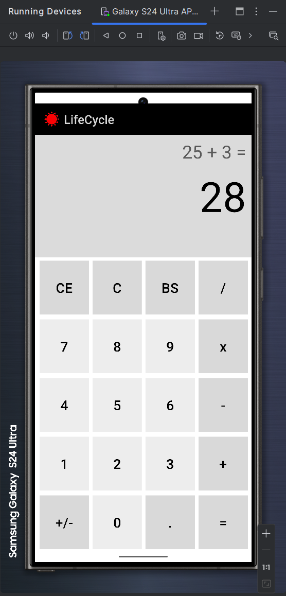

# IT4785 - Developing Mobile Applications

This repository contains demo for a Calculator app _(in both ConstraintLayout and LinearLayout)_ 

## UI Layout Result:

---
## Demo Result (with LinearLayout):
|    |          |
|:------------------------------------------:|:------------------------------------------------:|
|    |          |
| :----------------------------------------: |    :----------------------------------------:    |
|     |  |

**Course details:** _Developing Mobile Applications - IT4785 - Hanoi University of Science and Technology._

### _Create by Hoang Minh Hai. Oct 2024_
